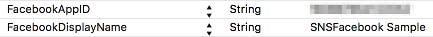
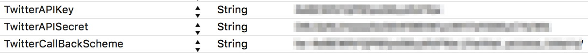

Make social networks management easier on iOS.

The 2.X is written in Objective-C (but fully compatible Swift). We are currently working on a full-Swift branch which should be available for the version 3.0.

## Specifications

### Requirements

- Minimum iOS versions required : **8.0**.
- Swift or Objective-C project
- Xcode 7.3+

### Facebook Features

- [x] Login / Logout, permissions
- [x] User informations
- [x] Facebook posts (message, link, images)
- [x] Like something
- [ ] My new awesome feature not available yet

### Twitter Features

- [x] Login / Logout
- [x] User informations (name, picture)
- [x] Post Tweets (simple message, picture, geolocalized picture)
- [ ] My new awesome feature not available yet

## Documentation

SNSSocial allows you to use different social networks with similar approach (login, sharing).
The library is compatible with Facebook and Twitter. Each social network is independant.

See [Github Wiki](https://github.com/smartnsoft/SNSSocial/wiki) to have a look of all features or just look header files which are fully commented.

* [SNSFacebook Documentation](https://github.com/smartnsoft/SNSSocial/wiki/SNSFacebook-Documentation)
* [SNSTwitter Documentation](https://github.com/smartnsoft/SNSSocial/wiki/SNSTwitter-Documentation)


## Usage

### Cocoapods Installation

You can simply add the library to your project by using CocoaPods.

```
pod 'SNSSocial', '~> 2.0'
```
No need of all social networks ? It is possible to specify what network use.

```
pod 'SNSSocial/Facebook', '~> 2.0'
or
pod 'SNSSocial/Twitter', '~> 2.0'
```

### Prepare your Info.plist

**Facebook**

For Facebook SDK, simply add the `FacebookAppID` and `FacebookDisplayName` keys



**Twitter**

For Twitter SDK, simply add the `TwitterAPIKey`, `TwitterAPISecret` and `TwitterCallBackScheme` keys




### Sample code - Share a link on facebook

```
[SNSFacebookInteractions postLink:@"http://smartnsoft.com/"
                        withTitle:@"Smart&Soft"
                      description:nil
                       pictureUrl:nil
             	 parentController:self
                      completion:^(id result, NSError * error)
{
	if (error == nil)
    {
    	// Do something
    }
    else
    {
    	// Display error
    }
}];
```

### Sample code - Post a tweet

```
[SNSTwitter postTweetWithMessage:@"Sample tweet with SNSSocial #iosdev"
        fromParentViewController:self
              		  completion:^(id result, NSError * error)
{
	if (error == nil)
    {
    	// Do something
    }
    else
    {
    	// Display error
    }
}];
```

## Communication

SNSSocial is one of the Smart&Soft Libraries dedicated to the iOS Development. 
It is developed and maintained by [Smart&Soft](http://www.smartnsoft.com).

- If you found a **bug**, open an **issue**. [Github issue page](https://github.com/smartnsoft/SNSSocial/issues).

- If you have a **feature request**, open an **issue**.
- If you want to **contribute**, submit a **pull request**.

## Changelog

The changelog is available on the dedicated [file](https://github.com/smartnsoft/SNSSocial/CHANGELOG.MD).

## License

```
This library is free software; you can redistribute it and/or
modify it under the terms of the GNU Lesser General Public
License as published by the Free Software Foundation; either
version 3 of the License, or (at your option) any later version.

This library is distributed in the hope that it will be useful,
but WITHOUT ANY WARRANTY; without even the implied warranty of
MERCHANTABILITY or FITNESS FOR A PARTICULAR PURPOSE. See the GNU
Lesser General Public License for more details.
```
